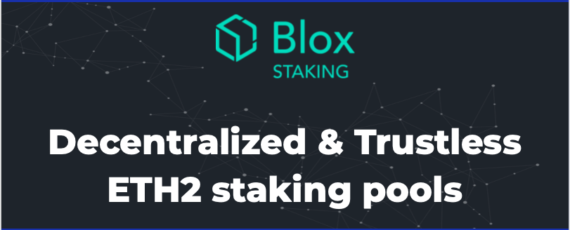
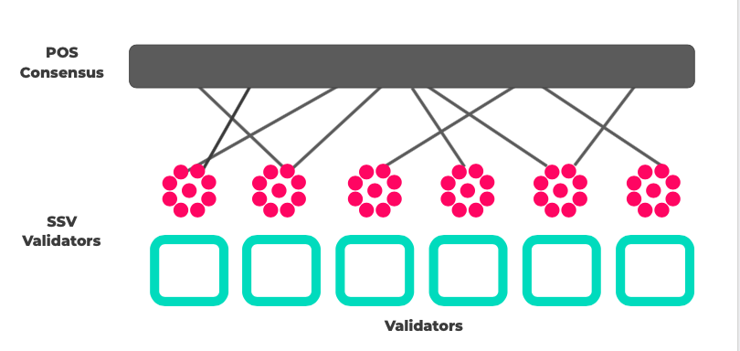

This repo aims to have in one place all the research around decentralized staking pools for eth 2.0.

### ETH 2.0 Decentralized Staking Pools - Summary
The backbone of decentralized staking pools is in distribuiting the control of the keys that control the validator and its withdrawal key. You can think of it as a giant multisig setup with some M-of-N threshold for signing attestations, block proposals and withdrawal transactions.\
A good starting point could be [this](https://www.youtube.com/watch?v=Jtz9b7yWbLo) presentation.

Adding a consensus protocol that rewards and punishes pool participants, controls withdrawal and onboarding then we have a full protocol for an open decentralzied staking pools network.\
The key word here is open as in autonomous and open to join by anyone.

### Overview
Conceptually a pools nerwork can be thought of as a 3 layer stack. 

<b>Layer 1</b> - Every pool is a collection of 32 ETH validators represented by a public BLS key.\
<b>Layer 2</b> - Every pool's public key has a corresponding distribuited private key controlled via an SSV group of operators.\
<b>Layer 3</b> - All pools (and their SSV groups) coordinate via a consensus layer which also deals with rewards, penalties, slashing, creation/ liquidation of pools and more.\

Pools network high-level architecture.  

The network has 2 actors: block producers (BP) and staker.\
A BP is a bonded actor (staked)  which has the responsibility of executing top consensus (attest to blocks, propose blocks and more) and local SSV group assignments (mostly eth2 network duties).  
A block producer is economically incentivized to run a pool node, participate in the network and more. The block producer's collateral is also staked.\
For more information reggarding network economics see [CDT2.0](https://github.com/bloxapp/eth2-staking-pools-research/blob/master/cdt2.md)

### Research
* [Pools mini paper]() for in-depth details
* [DKG theory](./dkg.md) 
* [DKG + key rotation POC](./go_minimal_pool)
* SSV nodes
    * [python ibft implementation](https://github.com/dankrad/python-ibft)
    * [python SSV node](https://github.com/dankrad/python-ssv)
    * [SSV compatible valdiator](https://github.com/alonmuroch/prysm/tree/ssv)
* [CDT2.0](https://github.com/bloxapp/eth2-staking-pools-research/blob/master/cdt2.md)
* [BLS keys](https://medium.com/@alonmuroch_65570/bls-signatures-part-1-overview-47d9eebf1c75) + [bi-linear pairings](https://medium.com/@alonmuroch_65570/bls-signatures-part-2-key-concepts-of-pairings-27a8a9533d0c)

